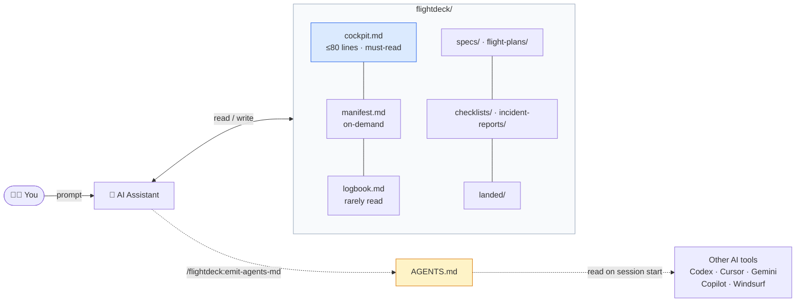

<div align="center">

# ✈️ flightdeck

**An operational protocol for AI-assisted engineering sessions.**

[](https://github.com/Yuelioi/flightdeck/releases)
[](LICENSE)
[](adapters/claude/README.md)
[](adapters/codex/README.md)
[](adapters/cursor/README.md)
[](adapters/gemini/README.md)
[](https://agents.md)

🇨🇳 [中文 README](README.zh.md) · 🇬🇧 English

</div>

---

> Your AI assistant forgets everything between chats. **flightdeck** is a directory convention plus a skill that gives it operational discipline across sessions — so the next session knows what you were doing, why, and what to do next.

> **Renamed from `workshop` (≤ v0.8.1)** — project identity is now operational reliability, not "maker space". Existing users: see [MIGRATION.md](MIGRATION.md).

## Table of contents

- [TL;DR](#tldr)
- [What it is](#what-it-is)
- [Architecture](#architecture)
- [What `cockpit.md` actually looks like](#what-cockpitmd-actually-looks-like)
- [Why it exists](#why-it-exists)
- [Design philosophy](#design-philosophy)
- [Install](#install)
- [Usage](#usage)
- [Compatibility](#compatibility)
- [How it compares](#how-it-compares)
- [FAQ](#faq)
- [Documentation](#documentation)
- [Contributing](#contributing)
- [Roadmap](#roadmap)
- [Acknowledgments](#acknowledgments)
- [License](#license)

## TL;DR

```text
/plugin marketplace add Yuelioi/flightdeck
/plugin install flightdeck@flightdeck-marketplace
```

Then in any Claude Code session inside a project that has (or might have) a `flightdeck/` directory: the protocol auto-loads, reads `flightdeck/cockpit.md`, reconciles against `git status`, and resumes your work.

For a brand-new project, `/flightdeck:flightdeck-workflow` bootstraps `flightdeck/cockpit.md` from a 2-question interview.

## What it is

A `flightdeck/` directory layout your AI reads and writes by convention:

```
flightdeck/
├── INDEX.md            # Quick lookup of subdir purposes + key files
├── cockpit.md          # Must-read every session entry (≤ 80 lines)
├── manifest.md         # On-demand: In flight + Blockers
├── logbook.md          # Rarely read: Recently finished + Deferred
│
├── specs/              # Design docs                    (when designing)
├── flight-plans/       # Implementation plans           (when breaking down work)
│
├── checklists/         # Repeatable procedures          (commands + checklists)
├── incident-reports/   # Lessons learned (no "forgot")  (recurring traps)
├── charts/             # External material              (RFCs, competitor code)
│
├── sketches/           # Long-term ideas                (unstarted)
├── safety-reviews/     # External review feedback       (raw + disposition)
├── kneeboard/          # Session scratch                (one session only)
│
└── landed/             # Archive umbrella
    ├── flight-plans/   # Shipped plans
    └── specs/          # Shipped designs
```

**Organized by *when you read what*** — not by topic. The folder / file name tells the AI when to consult it, which means routing is deterministic and the AI does not waste tokens loading irrelevant context.

## Architecture



`flightdeck/` is the source of truth. `AGENTS.md` is an emitted view of it — a wire format for tools that don't speak the protocol natively.

## What `cockpit.md` actually looks like

The single must-read file. Hard ceiling 80 lines. This is your AI's first read on every session:

```markdown
# Cockpit — payment-service

**Last updated**: 2026-05-28 by alice (shipped Stripe webhook refactor)
**Active focus**: stabilize Stripe webhook handler — see failing edge cases in incident-reports/

## Next session

1. Reproduce the duplicate-event bug from incident-reports/stripe-idempotency.md (Case 3).
2. Decide: idempotency key in DB vs Redis (cost vs latency tradeoff).
3. Update flight-plans/2026-05-26-stripe-hardening.md Phase 2 with the decision.

## Hanging tasks

- (none)
```

That's the whole entry experience. No 500-line context dump. No paragraph of project background the AI has to skim every time. **80 lines, by hard rule.** Anything historical or contextual is one file deeper — `manifest.md` / `logbook.md` / `specs/` — read on demand.

## Why it exists

Most "AI memory" systems fail by **saving everything**. The signal drowns. You get a junk drawer that even the AI gives up on reading.

**flightdeck does the opposite:**

| Discipline | What it enforces |
| --- | --- |
| **Strict write gate** | Only content that changes future behavior, influences decisions, or gets referenced repeatedly. Session logs, debug dumps, "let me just save this for later" — refused. |
| **Lifecycle per folder** | `kneeboard/` lives one session. Incident reports upgrade to project rules on third recurrence. Specs/flight-plans archive into `landed/` after ship. |
| **Authority order** | When sources disagree, the protocol declares who wins. No "AI gets confused" moments. |
| **Landing ritual** | 90% of session-end classifications are obvious. Only true ambiguity triggers brainstorming. |
| **Read-time decomposition** | cockpit / manifest / logbook separate what you read every session from what you open on demand from what you almost never re-read. |

## Design philosophy

> ✨ **Semantic clarity outranks thematic consistency.**

The flightdeck aviation metaphor is used where it sharpens operational intent — *not* as a theme to apply uniformly. Two folders (`specs/`, `sketches/`) intentionally keep neutral names because no aviation equivalent improves them. New concepts face the same test: if a word fits the metaphor but reads confusingly, reject it.

## Install

### Claude Code &nbsp;<sub>✅ tested</sub>

```text
/plugin marketplace add Yuelioi/flightdeck
/plugin install flightdeck@flightdeck-marketplace
```

To update: re-run `/plugin install`. To uninstall: `/plugin uninstall flightdeck`.

### Other AI tools &nbsp;<sub>⚠️ manifests in place, behavior untested</sub>

<details>
<summary><b>Codex CLI</b></summary>

```text
/plugins
```

Then search "flightdeck" → select → `Install Plugin`. See [adapters/codex/](adapters/codex/README.md).

</details>

<details>
<summary><b>Cursor</b></summary>

In Cursor Agent chat:

```text
/add-plugin flightdeck
```

Or search "flightdeck" in the plugin marketplace. See [adapters/cursor/](adapters/cursor/README.md).

</details>

<details>
<summary><b>Gemini CLI</b></summary>

```bash
gemini extensions install https://github.com/Yuelioi/flightdeck
gemini extensions update flightdeck   # to update later
```

See [adapters/gemini/](adapters/gemini/README.md).

</details>

### Direct install &nbsp;<sub>Claude Code, no marketplace</sub>

```powershell
# Windows
git clone https://github.com/Yuelioi/flightdeck.git
cd flightdeck
.\install.ps1
```

```bash
# macOS / Linux
git clone https://github.com/Yuelioi/flightdeck.git
cd flightdeck
./install.sh
```

### Scaffold a `flightdeck/` in your project

```powershell
.\install.ps1 -Scaffold minimal     # just cockpit.md
.\install.ps1 -Scaffold full        # all 11 subdirs + 3 entry files
```

```bash
./install.sh --scaffold=minimal
./install.sh --scaffold=full
```

## Usage

After install, the skill auto-loads whenever your project has a `flightdeck/` directory. You can also force-invoke it.

### Day 1 — bootstrap a new project

```text
cd my-project
/flightdeck:flightdeck-workflow
```

flightdeck detects the missing directory, asks you to confirm, runs a two-question interview (Active focus, first Next session item), and writes `flightdeck/cockpit.md`. Done. From the next session onward, the SessionStart hook loads the skill automatically.

### Every session

```
1. Read flightdeck/cockpit.md           (≤80 lines, ~5 seconds)
2. Reconcile against `git status`       (branch, uncommitted, stashes)
3. Execute "Next session" item #1       (or surface mismatch and ask)
```

### Slash commands

| Command | Auto-loads? | Purpose |
| --- | --- | --- |
| `/flightdeck:flightdeck-workflow` | ✅ via SessionStart hook when `flightdeck/` exists | The main protocol. Also bootstraps the directory if missing. |
| `/flightdeck:preflight` | — explicit only | Re-anchor a drifted long session against `cockpit.md` + git state. |
| `/flightdeck:landing` | — explicit only | Clean session wrap — classify new knowledge, update cockpit, optionally commit. |
| `/flightdeck:walkaround` | — explicit only | Integrity audit across 8 categories — protocol drift detection. |
| `/flightdeck:emit-agents-md` | — explicit only | Regenerate `AGENTS.md` between fenced markers from `cockpit.md`. |

All commands except `flightdeck-workflow` carry `disable-model-invocation: true` — they fire only on explicit slash, never auto-triggered from conversation context.

### Routing — what triggers what

The skill watches the conversation and consults the right folder automatically:

| What you say / what's happening | Skill routes AI to |
| --- | --- |
| *"What were we doing?"* / session start | `cockpit.md` |
| *"Why did the migration break?"* | `incident-reports/` (then debug) |
| *"How do I run the tests?"* | `checklists/` |
| *"Let's design a new X"* | `specs/` |
| *"Break this into tasks"* | `flight-plans/` |
| *"Here's review feedback from another AI"* | `safety-reviews/` (must add disposition) |
| *"Save this for later"* | `sketches/` (or refused by write gate if low-signal) |

### Session end

Say *"let's wrap up"* or similar. The AI runs the [landing ritual](skills/flightdeck-workflow/exit-ritual.md):

1. Apply classification heuristics to new knowledge (bug → `incident-reports/`, procedure → `checklists/`, one-off → discard).
2. Update `cockpit.md` (`Last updated`, `Next session`); update `manifest.md` / `logbook.md` if state diverged.
3. Commit.

The next session — even a different AI, even a different developer — picks up exactly where this one stopped.

## Compatibility

| Tool | Status | Manifest |
| --- | --- | --- |
| Claude Code | ✅ tested | [`.claude-plugin/`](.claude-plugin/) |
| Codex CLI / App | ⚠️ untested | [`.codex-plugin/`](.codex-plugin/) |
| Cursor | ⚠️ untested | [`.cursor-plugin/`](.cursor-plugin/) |
| Gemini CLI | ⚠️ untested | [`gemini-extension.json`](gemini-extension.json) + [`GEMINI.md`](GEMINI.md) |

The skill content under [`skills/`](skills/) is **tool-agnostic markdown**. Manifests are thin pointers that let each AI tool discover the skill. "Untested" means the manifest is in place and the install command should work, but no one has verified the AI actually follows the protocol end-to-end. **PRs with verification logs welcome** — see [`.github/PULL_REQUEST_TEMPLATE/manifest-verification.md`](.github/PULL_REQUEST_TEMPLATE/manifest-verification.md).

## How it compares

There are several adjacent approaches to giving an AI continuity. flightdeck sits in a specific spot:

| | flightdeck | [AGENTS.md](https://agents.md) | Cline Memory Bank | OpenSpec | Cursor MDC | Letta Code |
| --- | --- | --- | --- | --- | --- | --- |
| **Static project rules** | via emit | ✅ native | — | — | ✅ | — |
| **Session-to-session continuity** | ✅ | — | ✅ | — | — | ✅ |
| **Lifecycle state machine** (spec → plan → landed) | ✅ | — | — | ✅ | — | — |
| **Strict write gate** (anti junk-drawer) | ✅ | — | — | — | — | — |
| **Incident / lesson tracking** with root-cause discipline | ✅ | — | — | — | — | — |
| **External review disposition** tracking | ✅ | — | — | — | — | — |
| **Read-time decomposition** (cockpit/manifest/logbook split) | ✅ | — | — | — | — | — |
| **Tool-agnostic** (markdown + filesystem) | ✅ | ✅ | partial | ✅ | Cursor-only | — |
| **Skill self-loading** trigger | ✅ | — | ✅ | — | ✅ | — |
| **Cross-tool reach** | via AGENTS.md emit | native | — | — | — | — |

**Short version:**
- **AGENTS.md** is the wire format for static rules. flightdeck **emits into** AGENTS.md, doesn't compete with it.
- **Cline Memory Bank** gives raw memory persistence; flightdeck gives memory + lifecycle + write discipline.
- **OpenSpec** is the closest sibling for spec evolution markers; flightdeck adopts its `ADDED:` / `MODIFIED:` / `REMOVED:` convention.
- **Cursor MDC** is a path-based scope tag; flightdeck includes MDC frontmatter on incident-reports / checklists for Cursor interop.
- **Letta Code** has a skill-library promotion pattern; flightdeck adopts the gate-based incident-report → checklist promotion.

flightdeck is **opinionated**: write gate before storage, lifecycle before memory, peer reviews before merge. If that fits, it fits well.

## FAQ

<details>
<summary><b>Is this just a directory of markdown files?</b></summary>

Yes — that's the whole point. The protocol is `skills/flightdeck-workflow/SKILL.md`, which the AI loads. The state is plain markdown in `flightdeck/`. No database, no server, no service to deploy. Diff it in code review, grep it from the terminal, edit it in your editor. AI tools are participants in the protocol, not its custodians.

</details>

<details>
<summary><b>Why aviation? Isn't this just a coding tool?</b></summary>

The aviation framing reflects what the protocol actually does: session lifecycle, checklists under uncertainty, incident tracking, handoffs between operators, controlled autonomy with periodic re-anchoring. Those are aviation concepts — not metaphor, structure.

The framing has a guardrail: **"Semantic clarity outranks thematic consistency."** Two folders (`specs/`, `sketches/`) keep neutral names because no aviation word improves them. The metaphor is a tool, not a theme.

</details>

<details>
<summary><b>Does the 80-line cockpit ceiling actually matter?</b></summary>

Yes. The ceiling is **cognitive-load engineering**, not style. cockpit.md is read every session by both human and AI. At 80 lines it fits on one screen and consumes < 1k tokens. Without the ceiling, board-style files grow to 300-500 lines, the AI burns context just orienting, and humans stop reading them.

Hitting the ceiling forces a real decision: does this content earn its place in the entry-point, or does it belong in `manifest.md` (open work) / `logbook.md` (history) / out entirely?

</details>

<details>
<summary><b>What's the difference between flightdeck and just using AGENTS.md?</b></summary>

[AGENTS.md](https://agents.md) is the Linux Foundation cross-tool standard for project-level AI instructions — adopted by 60,000+ repos by mid-2026, with a controlled study showing 28.6% runtime reduction and 16.6% token reduction. If you only need "give the AI a static list of project rules", **AGENTS.md alone is enough**; flightdeck is overkill.

flightdeck sits **on top of** AGENTS.md, not in place of it:

| Concern | AGENTS.md alone | flightdeck |
| --- | --- | --- |
| Static project rules / style guide | ✅ | (use AGENTS.md) |
| Session-to-session continuity (cockpit, hand-off) | — | ✅ |
| Lifecycle state machine (spec → plan → landed) | — | ✅ |
| Write gate against junk-drawer accumulation | — | ✅ |
| Incident-report log (what went wrong, root causes) | — | ✅ |
| Cross-tool reach | native | via `/flightdeck:emit-agents-md` |

`/flightdeck:emit-agents-md` regenerates a fenced block inside `AGENTS.md` from `flightdeck/cockpit.md`. Maintain `cockpit.md` once; AI tools that read AGENTS.md (Codex CLI, Copilot, Cursor, Windsurf, Continue, Cody) see fresh project state.

</details>

<details>
<summary><b>What if I'm not using Claude Code?</b></summary>

Skill content under [`skills/`](skills/) is plain markdown — tool-agnostic. The manifests for Codex / Cursor / Gemini are in place but behaviorally untested (no one has confirmed end-to-end that those tools honor the protocol). The most valuable contribution right now is verifying one of them — see [Contributing](#contributing).

In the meantime, the [`/flightdeck:emit-agents-md`](skills/emit-agents-md/SKILL.md) command bridges to any tool that reads `AGENTS.md`.

</details>

<details>
<summary><b>How is this different from just writing a CLAUDE.md / project notes file?</b></summary>

A static rules file (CLAUDE.md, project notes) is **append-only knowledge**. flightdeck is a **state machine with lifecycle gates**:

- New mistake → `incident-reports/` with mandatory root-cause analysis (forbidden phrases: "forgot", "careless").
- Mistake recurs 3 times → promotion gate fires, you decide whether to elevate to `checklists/`.
- Checklist gets ignored anyway → promotion to project agent rules.
- Spec ships → moves to `landed/` and loses authority to current state.

The lifecycle is what prevents the "junk drawer" failure mode that static rules files always succumb to over time.

</details>

<details>
<summary><b>Why not use vector embeddings / RAG over my code?</b></summary>

flightdeck is solving a different problem. Vector retrieval gives you *similar* content; flightdeck gives you *operationally relevant* content with explicit routing. You don't want similarity-based retrieval to surface a stale incident report alongside three irrelevant ones — you want the active `cockpit.md` and nothing else until you ask.

flightdeck is also durable in ways embeddings aren't: it's plain text that survives a model upgrade, a vendor change, a switch between AI tools, or a code review where a human edits the files directly.

</details>

## Documentation

| File | What it covers |
| --- | --- |
| [skills/flightdeck-workflow/SKILL.md](skills/flightdeck-workflow/SKILL.md) | The entry-point your AI loads — protocol, authority order, lifecycle, design philosophy |
| [skills/flightdeck-workflow/folder-semantics.md](skills/flightdeck-workflow/folder-semantics.md) | What each folder holds and why; minimal-vs-full setup; future expansion slots |
| [skills/flightdeck-workflow/templates.md](skills/flightdeck-workflow/templates.md) | incident-report / checklist / sketch / safety-review / cockpit templates with frontmatter rules |
| [skills/flightdeck-workflow/exit-ritual.md](skills/flightdeck-workflow/exit-ritual.md) | The landing ritual — classification heuristics, red flags, promotion gates |
| [skills/preflight/SKILL.md](skills/preflight/SKILL.md) | `/flightdeck:preflight` — explicit entry ritual |
| [skills/landing/SKILL.md](skills/landing/SKILL.md) | `/flightdeck:landing` — explicit landing ritual |
| [skills/walkaround/SKILL.md](skills/walkaround/SKILL.md) | `/flightdeck:walkaround` — 8-category integrity audit |
| [skills/emit-agents-md/SKILL.md](skills/emit-agents-md/SKILL.md) | `/flightdeck:emit-agents-md` — AGENTS.md regeneration |
| [TEST_PLAN.md](TEST_PLAN.md) | RED-GREEN-REFACTOR cycle status |
| [MIGRATION.md](MIGRATION.md) | workshop → flightdeck upgrade notes |
| [CHANGELOG.md](CHANGELOG.md) | Version-by-version history |

## Contributing

### Verify a manifest end-to-end

Codex / Cursor / Gemini manifests are in place but **behaviorally untested**. The single most valuable contribution right now:

1. Install flightdeck on one of those tools.
2. Run a short session in a project with `flightdeck/`.
3. Verify the AI honors entry / triggers / landing per the [release-gate scenarios](flightdeck/specs/2026-05-23-v1.0-release-gate.md).
4. Open a PR with the transcript and flip the matrix from ⚠️ to ✅. Template: [.github/PULL_REQUEST_TEMPLATE/manifest-verification.md](.github/PULL_REQUEST_TEMPLATE/manifest-verification.md).

### Skill improvements

Skill changes follow a **RED-GREEN-REFACTOR** discipline: no edit without a failing test first. See [TEST_PLAN.md](TEST_PLAN.md).

The most valuable issue you can open: **a transcript of an AI that wriggled out of the protocol**. Rationalizations the skill doesn't address are the highest-signal contribution.

## Roadmap

See [TEST_PLAN.md](TEST_PLAN.md) for v1.0 ship status. Beyond v1.0:

| | Goal |
| --- | --- |
| **v1.1+** | Optional folders — `briefing/` (domain context), `blackbox/` (raw session log), `crew-handover/` (cross-AI handoff), `experiments/` (long-running probes). Deferred from v1.0 to keep rebrand scope contained; revisit when real usage demands each. |
| **Continuance benchmark** | A "pick up the thread" test suite for any AI agent. Hand it a mid-project flightdeck/, say "continue", measure recovery quality. |
| **Synthesis / compression** | Tools for compressing many archived specs into themed retrospectives without losing decision history. |
| **Live INDEX automation** | Optional hook to keep `INDEX.md` AUTO-sections in sync without manual intervention. |
| **End-to-end verification** of Codex / Cursor / Gemini (PRs welcome — manifests already in place). |
| **MCP server** exposing `flightdeck/` to MCP-aware clients. |

## Acknowledgments

flightdeck stands on the shoulders of:

- **[AGENTS.md](https://agents.md)** — the Linux Foundation cross-tool standard for AI project instructions. flightdeck emits into AGENTS.md and treats it as the wire format.
- **[OpenSpec](https://github.com/openspec/openspec)** — the spec-evolution markers (`ADDED:` / `MODIFIED:` / `REMOVED:`) come straight from OpenSpec convention.
- **[Cursor MDC](https://docs.cursor.com)** — the path-scoped frontmatter (`globs:` / `alwaysApply:`) on incident-reports / checklists for Cursor compatibility.
- **[Letta Code](https://github.com/letta-ai/letta)** — the skill-library promotion pattern inspired the multi-criterion incident-report → checklist gate.
- **[superpowers](https://github.com/anthropic-experimental/superpowers)** — the directed-graph protocol style and `brainstorming` / `writing-plans` skill conventions.
- **[Cline Memory Bank](https://docs.cline.bot/improving-your-prompting-skills/custom-instructions-library/cline-memory-bank)** — the original "AI persistent memory" pattern that motivated flightdeck's stricter write gate.
- **[Roo Boomerang](https://github.com/RooCodeInc)** — the subagent context-survival pattern noted for v1.x adoption.

And the maintainer's own pain — every folder, every rule, every gate exists because a previous session burned a previous context window or lost a previous insight.

## License

[MIT](LICENSE) © 月离 (Yuelioi)

---

<div align="center">

If flightdeck saved you a context window, [star the repo](https://github.com/Yuelioi/flightdeck/stargazers) — it helps others find it.

</div>
