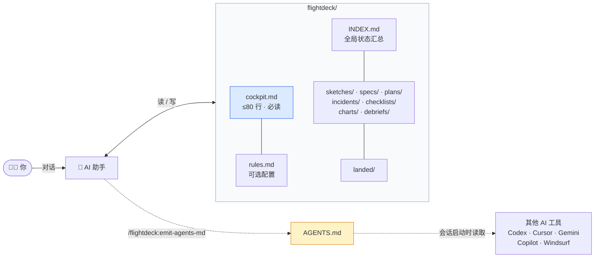

<div align="center">

# ✈️ flightdeck

**AI 协作工程的操作协议。**

[](https://github.com/Yuelioi/flightdeck/releases)
[](LICENSE)
[](adapters/claude/README.md)
[](adapters/codex/README.md)
[](adapters/cursor/README.md)
[](adapters/gemini/README.md)
[](https://agents.md)

🇬🇧 [English README](README.md) · 🇨🇳 中文

</div>

---

> AI 助手在两次对话之间会失忆。**flightdeck** 用一套目录约定加一个 skill，赋予它跨会话的操作纪律 —— 让下一次会话能从上一次的位置继续，清楚你之前在做什么、为什么、下一步该做什么。

## 目录

- [TL;DR](#tldr)
- [它是什么](#它是什么)
- [架构](#架构)
- [`cockpit.md` 真实长什么样](#cockpitmd-真实长什么样)
- [为什么需要它](#为什么需要它)
- [设计哲学](#设计哲学)
- [安装](#安装)
- [用法](#用法)
- [兼容性](#兼容性)
- [横向对比](#横向对比)
- [FAQ](#faq)
- [文档](#文档)
- [贡献](#贡献)
- [Roadmap](#roadmap)
- [致谢](#致谢)
- [License](#license)

## TL;DR

```text
/plugin marketplace add Yuelioi/flightdeck
/plugin install flightdeck@flightdeck-marketplace
```

然后在工作会话开始时运行 `/flightdeck:preflight` —— 唯一入口。已有项目里它读取 `flightdeck/cockpit.md`、与 `git status` 对账、报告你上次停在哪。全新项目（还没有 `cockpit.md`）则通过两个问题引导生成一个。**没有任何东西会自动运行** —— 不调用它，flightdeck 什么都不做。

## 它是什么

一个 `flightdeck/` 目录布局，AI 按约定读和写：

```
flightdeck/
├── cockpit.md          # 每次会话必读入口（≤ 80 行）
├── rules.md            # 可选：项目配置（开关 + 项目规范）
├── INDEX.md            # 全局状态汇总 —— 跨所有文件夹的衍生索引
│
├── sketches/           # 早期想法、草稿
│   └── INDEX.md
├── specs/              # 范围明确的设计文档
│   └── INDEX.md
├── plans/              # 分步实施计划（implements: 对应的 spec）
│   └── INDEX.md
├── incidents/          # 错题集（禁止"忘了"）
│   └── INDEX.md
├── checklists/         # 可复用流程
│   └── INDEX.md
├── charts/             # 外部资料（RFC、竞品源码）
│   └── INDEX.md
├── debriefs/           # 外部 review 反馈（原文 + 处置）
│   └── INDEX.md
│
└── landed/             # 已完成文件和知识文档的归档仓
    └── INDEX.md
```

**文件夹 = 类型（隐式）。** 每个文件夹本身就声明了里面的文件*是什么* —— 不需要 per-file 的类型字段。**`status` 是唯一必填的 frontmatter 字段**，加上可选的知识路由字段和 `implements:`（仅 plans 使用，指向它所执行的 spec）。

每个文件夹，以及根目录，都有一个 `INDEX.md` —— 文件名、状态、一行摘要的衍生索引。读 `INDEX.md` 就能看到整个文件夹的状态，不用逐个打开文件。根目录 `INDEX.md` 是跨所有文件夹的全局状态汇总。

**cockpit.md** 是纯粹的焦点：Active focus / Next session / Hanging tasks。硬上限 80 行。

**生命周期：** sketch → spec → plan（plan 用 `implements:` 指向对应 spec）；`status` 显式推进；`landed/` 是归档仓。

与 superpowers skill 对齐：`brainstorming` → spec，`writing-plans` → plan。

## 架构



`flightdeck/` 是单一权威源。`AGENTS.md` 是它的衍生视图 —— 给不原生说本协议的工具用的 wire format。

## `cockpit.md` 真实长什么样

唯一必读入口。硬上限 80 行。这是你 AI 每次会话的第一读：

```markdown
# Cockpit — payment-service

**Last updated**: 2026-05-28 by alice (Stripe webhook 重构已上线)
**Active focus**: 稳住 Stripe webhook handler —— 见 incidents/ 里失败的边界 case

## Next session

1. 复现 incidents/stripe-idempotency.md 第三例的重复事件 bug。
2. 决策：幂等键放 DB 还是 Redis（成本 vs 延迟 trade-off）。
3. 用决策结果更新 plans/2026-05-26-stripe-hardening.md Phase 2。

## Hanging tasks

- (none)
```

整个入场体验就这些。没有 500 行的上下文堆砌，没有每次都要重新扫一遍的项目背景。**80 行，硬性规则。** 历史性、情境性的内容都下沉一层 —— 先读 `INDEX.md` 定位，再按需打开具体文件。

## 为什么需要它

大多数 "AI memory" 系统败在**什么都存**：信号被噪声淹没，最终沦为一个连 AI 自己都不愿再读的垃圾抽屉。

**flightdeck 反其道而行：**

| 纪律 | 强制的内容 |
| --- | --- |
| **严格守门** | 只写那些"会改变未来行为 / 影响决策 / 反复引用"的内容。会话日志、debug dump、"先记一下以后看" —— 拒绝。 |
| **文件夹 = 类型** | 文件所在的文件夹声明它是什么。`status` 是唯一的显式 frontmatter 字段，随工作推进显式更新。 |
| **权威序** | 多个来源冲突时，协议明确谁说了算。不存在"AI 困惑了"的时刻。 |
| **INDEX 优先读** | 每个文件夹的 `INDEX.md` 是衍生汇总 —— 文件名、状态、一行描述。AI 先读 `INDEX.md`，再按需开具体文件，大项目省 token。 |
| **Landing ritual** | 90% 的会话末分类都是显然的，只有真模糊才调 brainstorming。 |
| **读时分层** | `cockpit.md` 是唯一必读入口；其余内容按确定性的文件夹路由按需打开。 |

## 设计哲学

> ✨ **Semantic clarity outranks thematic consistency.**（语义清晰高于主题统一）

flightdeck 的航空隐喻是用来**让操作意图更清晰**的 —— 不是统一套主题。文件夹名以清晰为第一标准。未来新增概念也走同一道考验：词如果配主题但读起来反而模糊，拒绝。

## 安装

### Claude Code &nbsp;<sub>✅ 已测试</sub>

```text
/plugin marketplace add Yuelioi/flightdeck
/plugin install flightdeck@flightdeck-marketplace
```

更新：重跑 `/plugin install`。卸载：`/plugin uninstall flightdeck`。

### 其他 AI 工具 &nbsp;<sub>⚠️ manifest 已到位、行为未验证</sub>

<details>
<summary><b>Codex CLI</b></summary>

```text
/plugins
```

搜 "flightdeck" → 选 → `Install Plugin`。详见 [adapters/codex/](adapters/codex/README.md)。

</details>

<details>
<summary><b>Cursor</b></summary>

在 Cursor Agent chat 里：

```text
/add-plugin flightdeck
```

或者在 plugin marketplace 里搜 "flightdeck"。详见 [adapters/cursor/](adapters/cursor/README.md)。

</details>

<details>
<summary><b>Gemini CLI</b></summary>

```bash
gemini extensions install https://github.com/Yuelioi/flightdeck
gemini extensions update flightdeck   # 更新
```

详见 [adapters/gemini/](adapters/gemini/README.md)。

</details>

### 直接安装 &nbsp;<sub>Claude Code，不走 marketplace</sub>

```powershell
# Windows
git clone https://github.com/Yuelioi/flightdeck.git
cd flightdeck
.\install.ps1
```

```bash
# macOS / Linux
git clone https://github.com/Yuelioi/flightdeck.git
cd flightdeck
./install.sh
```

### 在项目里创建一个 `flightdeck/` 骨架

```powershell
.\install.ps1 -Scaffold minimal     # 只 cockpit.md
.\install.ps1 -Scaffold full        # 完整子目录 + cockpit.md + 可选 rules.md
```

```bash
./install.sh --scaffold=minimal
./install.sh --scaffold=full
```

## 用法

安装后，在会话开始时运行 `/flightdeck:preflight` —— 它是唯一入口。没有任何东西会自动运行；不调用它，flightdeck 什么都不做。

### 快速上手 —— 为新项目初始化

```text
cd my-project
/flightdeck:preflight
```

当还没有 `flightdeck/cockpit.md` 时，`/flightdeck:preflight` 会征询确认，通过两个简短问题（Active focus、Next session 第一条）生成 `flightdeck/cockpit.md`，然后停下。之后每次会话，再运行一次 `/flightdeck:preflight` 即可读回并续上。

**已经有一个旧版 `flightdeck/`？** 入场时 `/flightdeck:preflight`（以及 `walkaround` 审计）会读取布局版本，并在确认后引导你迁移到当前布局 —— 详见 [MIGRATION.md](MIGRATION.md)。迁移绝不静默：任何文件移动前都先征得你同意。

### 每次会话开始

运行 `/flightdeck:preflight`，它会：

```
1. 读 flightdeck/cockpit.md         （≤80 行，~5 秒）
2. 跟 `git status` 对账              （branch、未提交、stash）
3. 报告 "Next session" 第一条        （你说 "go" 再执行 —— 或上浮不一致点先问你）
```

### Slash 命令

| 命令 | 用途 |
| --- | --- |
| `/flightdeck:preflight` | **唯一入口。** 没 deck 时初始化；有则把 `cockpit.md` 跟 git 对账并报告下一项。 |
| `/flightdeck:landing` | Session 收尾 —— 分类新知识、更新 cockpit、可选 commit。 |
| `/flightdeck:walkaround` | 10 类完整性审计 —— 协议漂移检测。 |
| `/flightdeck:emit-agents-md` | 从 `cockpit.md` 在 fenced markers 之间重生 `AGENTS.md`。 |

所有命令都带 `disable-model-invocation: true` —— 只在用户显式打 slash 时触发；会话开始不加载任何东西。

### 路由表 —— 什么情况下进哪个文件夹

`/flightdeck:preflight` 加载协议后，AI 按对话需要路由到对应文件夹：

| 你说 / 场景 | Skill 把 AI 导到 |
| --- | --- |
| *"我们上次干到哪了？"* / 会话开始 | `cockpit.md` |
| *"为啥这个迁移挂了？"* | `incidents/`（然后开 debug） |
| *"测试怎么跑？"* | `checklists/` |
| *"我们设计一个新 X"* | `specs/`（新的范围设计文档） |
| *"把这个拆成任务"* | `plans/`（执行对应 spec） |
| *"这是另一个 AI 的 review 反馈"* | `debriefs/`（必须带处置） |
| *"先记一下以后看"* | `sketches/`（或被守门拒绝） |

### 会话结束

运行 `/flightdeck:landing`（即 [landing ritual](skills/preflight/exit-ritual.md)）：

1. 对新知识应用分类启发式（bug → `incidents/`、流程 → `checklists/`、一次性 → 不写）。
2. 更新 `cockpit.md`（`Last updated`、`Next session`，有变动时补写 `## Hanging tasks`）。
3. Commit。

下一次会话 —— 哪怕换了 AI、换了开发者 —— 能从上次结束的位置无缝接着干。

## 兼容性

| 工具 | 状态 | Manifest |
| --- | --- | --- |
| Claude Code | ✅ 已测试 | [`.claude-plugin/`](.claude-plugin/) |
| Codex CLI / App | ⚠️ 未测试 | [`.codex-plugin/`](.codex-plugin/) |
| Cursor | ⚠️ 未测试 | [`.cursor-plugin/`](.cursor-plugin/) |
| Gemini CLI | ⚠️ 未测试 | [`gemini-extension.json`](gemini-extension.json) + [`GEMINI.md`](GEMINI.md) |

[`skills/`](skills/) 下的 skill 内容是 **tool-agnostic 的 markdown**。Manifest 只是给各 AI 工具一个发现 skill 的钉子。**"未测试"的意思**：manifest 已到位、上面的安装命令应该能跑，但还没有人端到端验证过 AI 真的会跟着协议走。**带验证日志的 PR 非常欢迎** —— template 见 [.github/PULL_REQUEST_TEMPLATE/manifest-verification.md](.github/PULL_REQUEST_TEMPLATE/manifest-verification.md)。

## 横向对比

给 AI 加持续性这件事有几个相邻方案。flightdeck 占的是这块：

| | flightdeck | [AGENTS.md](https://agents.md) | Cline Memory Bank | OpenSpec | Cursor MDC | Letta Code |
| --- | --- | --- | --- | --- | --- | --- |
| **静态项目规范** | 通过 emit | ✅ 原生 | — | — | ✅ | — |
| **跨 session 接续** | ✅ | — | ✅ | — | — | ✅ |
| **生命周期模型**（文件夹=类型 · status · landed） | ✅ | — | — | ✅ | — | — |
| **严格守门**（防 junk-drawer） | ✅ | — | — | — | — | — |
| **错题 / 教训追踪**（含根因纪律） | ✅ | — | — | — | — | — |
| **外部 review disposition** 追踪 | ✅ | — | — | — | — | — |
| **读时分层**（cockpit 优先；按需文件夹路由） | ✅ | — | — | — | — | — |
| **INDEX 优先省 token**（各文件夹衍生索引） | ✅ | — | — | — | — | — |
| **工具无关**（markdown + filesystem） | ✅ | ✅ | 部分 | ✅ | 仅 Cursor | — |
| **单一显式入口**（`/preflight`） | ✅ | — | — | — | — | — |
| **跨工具触达** | 通过 AGENTS.md emit | 原生 | — | — | — | — |

**一句话总结：**
- **AGENTS.md** 是静态规则的 wire format。flightdeck **emit 进** AGENTS.md，不竞争。
- **Cline Memory Bank** 提供原始 memory 持久化；flightdeck 提供 memory + 生命周期 + 写入纪律。
- **OpenSpec** 是 spec 演化标记的近亲；flightdeck 采纳了它的 `ADDED:` / `MODIFIED:` / `REMOVED:` 约定。
- **Cursor MDC** 是路径范围标签；flightdeck 在 incidents / checklists 上加 MDC frontmatter 以兼容 Cursor。
- **Letta Code** 有 skill-library 晋升模式；flightdeck 采纳了它的多准则 incident → checklist 晋升门。

flightdeck **立场鲜明**：写入门控先于存储、生命周期先于 memory、同行评审先于合并。一旦契合你的工作方式，便会非常契合。

## FAQ

<details>
<summary><b>这就是一堆 markdown 文件而已？</b></summary>

对 —— 就是这个意思。协议是 `skills/preflight/SKILL.md`（加上 `protocol.md`），运行 `/flightdeck:preflight` 时 AI 加载它。状态是 `flightdeck/` 下面的纯 markdown。没数据库、没服务器、不用部署任何东西。可以在代码评审里 diff 它、在终端里 grep 它、在编辑器里改它。AI 工具是协议的**参与者**，而非它的保管者。

</details>

<details>
<summary><b>为啥用航空隐喻？这不就是个编程工具吗？</b></summary>

航空框架反映的是协议实际在做的事：session 生命周期、不确定下的 checklist、事故追踪、operator 之间的交接、带周期性重锚定的受控自主。这些就是航空概念 —— 不是比喻，是结构。

框架自带护栏：**"语义清晰高于主题统一"**。文件夹名以清晰为第一标准。隐喻是工具，不是主题。

</details>

<details>
<summary><b>80 行 cockpit 天花板真的重要吗？</b></summary>

是。这个天花板是**认知负载工程**，不是风格。cockpit.md 每次会话都被人和 AI 一起读。80 行能一屏装下，token 消耗 < 1k。没有这个天花板，board 风格的文件会膨胀到 300-500 行，AI 光是定位就要消耗大量上下文，人也就索性不读了。

触及上限会强制一次真实的取舍：这条内容配得上留在入口文件吗？还是应该下沉到更深的文件夹（`specs/`、`incidents/`）或 `## Hanging tasks`，又或者干脆移除？

</details>

<details>
<summary><b>flightdeck 和直接用 AGENTS.md 区别在哪？</b></summary>

[AGENTS.md](https://agents.md) 是 Linux Foundation 主导的跨工具 AI 指令标准 —— 2026 年中已被 6 万+ 仓库采用，控制实验显示运行时间下降 28.6%、token 消耗下降 16.6%。如果你只需要"给 AI 一份静态项目规范"，**单用 AGENTS.md 就足够**，flightdeck 属于大材小用。

flightdeck **架在** AGENTS.md 之上，不是替代：

| 关注点 | 单用 AGENTS.md | flightdeck |
| --- | --- | --- |
| 静态项目规范 / 风格指南 | ✅ | （用 AGENTS.md） |
| 跨 session 接续（cockpit、交接） | — | ✅ |
| 生命周期模型（文件夹=类型 · status · landed） | — | ✅ |
| 防止 junk-drawer 堆积的写入门控 | — | ✅ |
| 错题本（出过什么 bug、根因） | — | ✅ |
| 跨工具触达 | 原生 | 通过 `/flightdeck:emit-agents-md` |

`/flightdeck:emit-agents-md` 从 `flightdeck/cockpit.md` 重新生成 AGENTS.md 里的 fenced block。`cockpit.md` 维护一份；读 AGENTS.md 的 AI 工具（Codex CLI、Copilot、Cursor、Windsurf、Continue、Cody）都能看到最新项目状态。

</details>

<details>
<summary><b>我不用 Claude Code 怎么办？</b></summary>

[`skills/`](skills/) 下的 skill 内容是 tool-agnostic 的纯 markdown。Codex / Cursor / Gemini 的 manifest 已经到位，但行为还没人端到端验证。当下最有价值的贡献就是去验证其中一个 —— 详见[贡献](#贡献)。

在那之前，[`/flightdeck:emit-agents-md`](skills/emit-agents-md/SKILL.md) 命令是通向任意读 `AGENTS.md` 的工具的桥梁。

</details>

<details>
<summary><b>这和写一份 CLAUDE.md / 项目笔记有啥不同？</b></summary>

静态规则文件（CLAUDE.md、项目笔记）是**只追加的知识**。flightdeck 是**带生命周期门的状态机**：

- 新错误 → `incidents/`，强制根因分析（禁用短语："忘了"、"不小心"）。
- 错误反复 3 次 → 晋升门触发，你决定是否升级到 `checklists/`。
- Checklist 被无视 → 再次晋升到项目 agent 规则。
- 工作落地 → `status` 推进到 `done`，文件移到 `landed/`，对当前状态不再有权威性。

正是这套生命周期防止了静态规则文件长期必然滑向的"垃圾抽屉"失败模式。

</details>

<details>
<summary><b>为啥不用向量 embedding / RAG 索引代码？</b></summary>

flightdeck 解决的问题不一样。向量检索给你**相似**内容；flightdeck 给你带明确路由的**操作相关**内容。你不会想要相似检索把一个已废弃的 incident 文件和三个无关的一起翻出来 —— 你要的是当前 `cockpit.md`，没别的，除非你主动问。

flightdeck 在 embedding 做不到的方面也更耐用：纯文本，能扛过模型升级、厂商切换、AI 工具切换、人在 code review 里直接改文件。

</details>

## 文档

| 文件 | 覆盖内容 |
| --- | --- |
| [skills/preflight/SKILL.md](skills/preflight/SKILL.md) | `/flightdeck:preflight` —— 唯一入场 ritual（init-or-read） |
| [skills/preflight/protocol.md](skills/preflight/protocol.md) | 协议教科书 —— 数据模型、权威序、生命周期、路由、写入门控 |
| [skills/preflight/folder-semantics.md](skills/preflight/folder-semantics.md) | 每个文件夹的语义和职责；minimal vs full；future expansion slots |
| [skills/preflight/templates.md](skills/preflight/templates.md) | incident / checklist / sketch / debrief / cockpit 模板含 frontmatter 规则 |
| [skills/preflight/exit-ritual.md](skills/preflight/exit-ritual.md) | Landing ritual —— 分类启发式、red flags、晋升门 |
| [skills/landing/SKILL.md](skills/landing/SKILL.md) | `/flightdeck:landing` —— 显式 landing ritual |
| [skills/walkaround/SKILL.md](skills/walkaround/SKILL.md) | `/flightdeck:walkaround` —— 10 类完整性审计 |
| [skills/emit-agents-md/SKILL.md](skills/emit-agents-md/SKILL.md) | `/flightdeck:emit-agents-md` —— AGENTS.md 重生 |
| [TEST_PLAN.md](TEST_PLAN.md) | RED-GREEN-REFACTOR 测试状态 |
| [MIGRATION.md](MIGRATION.md) | 版本升级与布局迁移笔记 |
| [CHANGELOG.md](CHANGELOG.md) | 按版本的变更记录 |

## 贡献

### 端到端验证一个 manifest

Codex / Cursor / Gemini 的 manifest 都到位了，但**行为没测过**。当下最有价值的贡献：

1. 在其中一个工具上装 flightdeck。
2. 在有 `flightdeck/` 的项目里跑一段短 session。
3. 按 [release-gate 场景](flightdeck/landed/specs/2026-05-23-v1.0-release-gate.md) 验证 AI 真的按 entry / triggers / landing 走。
4. 提 PR 带上对话记录，把矩阵从 ⚠️ 翻到 ✅。Template：[.github/PULL_REQUEST_TEMPLATE/manifest-verification.md](.github/PULL_REQUEST_TEMPLATE/manifest-verification.md)。

### Skill 本身的改进

按 **RED-GREEN-REFACTOR** 纪律：没跑测试不准改。详见 [TEST_PLAN.md](TEST_PLAN.md)。

你能提交的最有价值的 issue：**一段 AI 规避协议的对话记录**。Skill 尚未覆盖的 rationalization 是信号最高的贡献。

## Roadmap

v1.x ship 状态见 [TEST_PLAN.md](TEST_PLAN.md)。v1.2 之后：

| | 目标 |
| --- | --- |
| **v1.3+** | 可选文件夹 —— `briefing/`（领域背景）、`blackbox/`（原始 session log）、`crew-handover/`（跨 AI 交接）、`experiments/`（长期 probe）。待实际使用证明需求再加。 |
| **Continuance benchmark** | 给任意 AI 一个中途断片的项目，让它"接着干"，量化恢复能力。 |
| **Synthesis / 压缩** | 把大量归档文件压成主题复盘，不丢决策历史。 |
| **INDEX 自动化** | 可选 hook 保持各文件夹 `INDEX.md` 同步，无需人工干预。 |
| **端到端验证 Codex / Cursor / Gemini**（欢迎 PR —— manifest 已就位）。 |
| **MCP server** 把 `flightdeck/` 暴露给 MCP-aware client。 |

## 致谢

flightdeck 站在这些项目的肩上：

- **[AGENTS.md](https://agents.md)** —— Linux Foundation 跨工具 AI 项目指令标准。flightdeck emit 进 AGENTS.md，把它当作 wire format。
- **[OpenSpec](https://github.com/openspec/openspec)** —— spec 演化标记（`ADDED:` / `MODIFIED:` / `REMOVED:`）直接来自 OpenSpec 约定。
- **[Cursor MDC](https://docs.cursor.com)** —— incidents / checklists 上的路径范围 frontmatter（`globs:` / `alwaysApply:`）用于 Cursor 兼容。
- **[Letta Code](https://github.com/letta-ai/letta)** —— skill-library 晋升模式启发了多准则 incident → checklist 门。
- **[superpowers](https://github.com/anthropic-experimental/superpowers)** —— 有向图协议风格、`brainstorming` / `writing-plans` skill 约定。
- **[Cline Memory Bank](https://docs.cline.bot/improving-your-prompting-skills/custom-instructions-library/cline-memory-bank)** —— 原始"AI 持久化 memory"模式，催生了 flightdeck 更严格的写入门控。
- **[Roo Boomerang](https://github.com/RooCodeInc)** —— subagent 上下文窗口求生模式，标记给 v1.x。

以及维护者自己踩过的坑 —— 每个文件夹、每条规则、每道门，都是因为某一段 session 烧掉了上一个上下文窗口、丢失了上一个洞察才得以存在。

## License

[MIT](LICENSE) © 月离 (Yuelioi)

---

<div align="center">

如果 flightdeck 帮你省下过一个上下文窗口，[给个 star](https://github.com/Yuelioi/flightdeck/stargazers) —— 让更多人能找到它。

</div>
